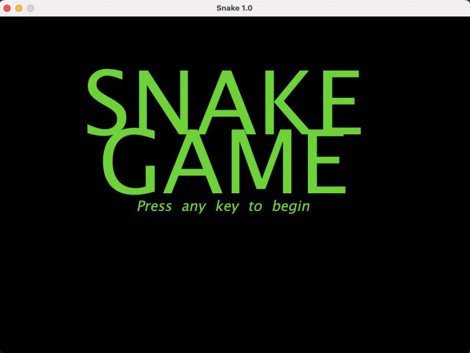

# Snake Game
### By: Casey Maloney
# A game where a hungry snake grows in length when he eats an apple

# Project Abstract

Snake is a game where the purpose is for the player to maneuver a line that grows in length.

               HOW DOES THE GAME WORK? 
        
The snake will always start at the center of the board, moving up. The snake moves at a constant speed and can only move in four directions: Up, Down, Left, and Right. The arrow keys by the player control the movement of the snake. The snake grows by eating "apples." These apples appear at random times, lasting a random amount of time. This time interval is typically long enough for the snake to get to the apple. There can only be one apple that appears at a time. When the snake runs into the apple or "eats" the apple, it gets longer. The game continues until the snake dies. The snake dies in two ways: running into the edge of the board and running into its tail. The score at the end of the game is based on how many apples have been eaten. The game continuously gets more challenging as the snake gets bigger.

                            

 

                GOAL OF THE GAME: 
        
The goal of the game is to eat as many apples as the snake can before dying. Remember, the snake gradually gets longer the more apples it consumes, so you have to be careful not to hit its tail!

# Project Relevance

This project follows an *_Object-Oriented Design_*. Object-Oriented Design is the process of planning a system of interacting objects to solve a problem. In our project, we will have all different classes working together to make a working game. This project falls user the object-oriented programming approach. This allows the writing of programs and the help of certain classes and real-time objects. This is a user-defined and abstract data type. The purpose of the classes is to store data and information, and the members of the class will define the behavior. 

OOP's main goal is to attach the data and functions that operate on them so that no other person or part of the code can access the data except for that function. OOP tries to implement real-world qualities. These qualities can include: 
                   
                       - inheritance 
                       - hiding
                       - polymorphism

This project will also be working with *_multithreading_* and using *_unit testing_* to test our work. We will be solving the famous producer-consumer problem using threads. We will be making data with one thread and moving the data to another thread. This will be using multiple producers of data and a single consumer to process the data. This will be using a type of queue at the programmer's choice. Unit testing will be used to write a model class for the game itself and keeping track of high scores. 

Multithreading is very important because it allows multiple parts of the same system to execute simultaneously. There are many benefits to using threads. 
                       
                       
                        1. Responsiveness 
                        2. Resource Sharing 
                        3. Economy 
                        4. Utilization of multiprocessor architecture 
                        
       Responsiveness: allows a program to run even if part of it is blocked
       Recourse Sharing: all threads share their memory, data, files, etc. 
       Economy: more economical, its less expensive and less time consuming 
       Utilization of Multiprocessor: each thread can run on a different processor 
       
       
Unit testing is essential because it ensures that all the code is the best before deployment. It provides code quality, saves time and money, and helps developers write better code efficiently. 

# Conceptual Design

Take the given code and implement the snake game using threads. The programmer will use the threads to test for collisions and the direction of the snake. 

Create a test for the model class for the game itself and for the model class for keeping track of high scores. These model classes shouldn't have any input or output. 

Add obstacles that pop up on top of the apples. These obstacles, if hit, will kill the snake, and the game will be over. Randomly have the obstacles pop up right after the snake eats the apple close to the snake. The snake can now die in three ways: hitting a wall, hitting its tail, or hitting an obstacle. 

Add a face to the snake. This will allow the player to know which end they are looking at. 

The snake moves at a constant speed. Instead, change the pace as the snake gets longer. The rate of the snake will gradually increase the more the snake eats the apples. This will provide a more complex challenge for the user. 

Provide a scoreboard after the game is over. The top five highest scores are displayed and are not to be lost after the game ends. 

Add keys to pause, resume, or restart the game.

# Background 

                URL: https://github.com/renanpvaz/java-snake 
                   
_BUILDING_

        - This project will be using Java, but if comfortable, you can use Python
        - I also ran this code using IntelliJ, probably can use any other idle as long as they are compatible with GitHub 
        - Need to make sure you have the most up to data JDK if writing in Java 
        - This source code is also using a .jar file, so make sure you have the most up-to-date one 
                                https://github.com/renanpvaz/java-snake/releases

_RUNNING_

        - To run this, you need to clone the GitHub repository
        - Once cloned, you need to ensure you are in the folder where the .jar file is located. If not, it won't be able to run 
        - Once you change your directory and are in the correct folder, in terminal, type this command 
                                        
                                        java -jar snake.jar 
                                        
        - Once you hit enter, the snake game should come up, and you will be able to play. 
                        
                

 

